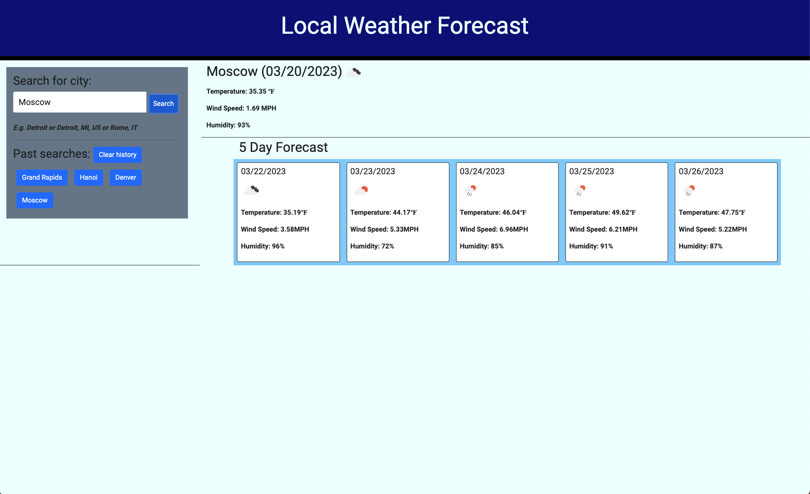

# 6-Weather-Dashboard

## Description

This assignment application implements newly instructed upon code from 3rd party APIs jQuery and Day.js in addition to previously learned HTML, CSS, and JavaScript. The user will be able to add to-do tasks into a standard work day schedule and save them for planning purposes. This application helped teach me how to implement jQuery and Day.js as supplements to JavaScript. 

## Installation

N/A

## Usage

Website:  https://tagne13.github.io/6-Weather-Dashboard/

Repository:  https://github.com/Tagne13/6-Weather-Dashboard.git 

## Credits

Special thank you to tutor Andres Long through the Bootcamp tutor team for assistance with JavaScript debugging in the create schedule function. 

https://jquery.com/

https://day.js.org/en/

https://getbootstrap.com/

## License

Please refer to the license in the repo.